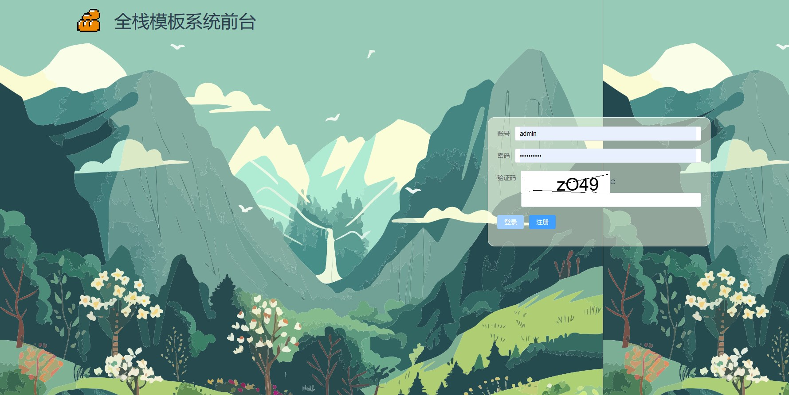
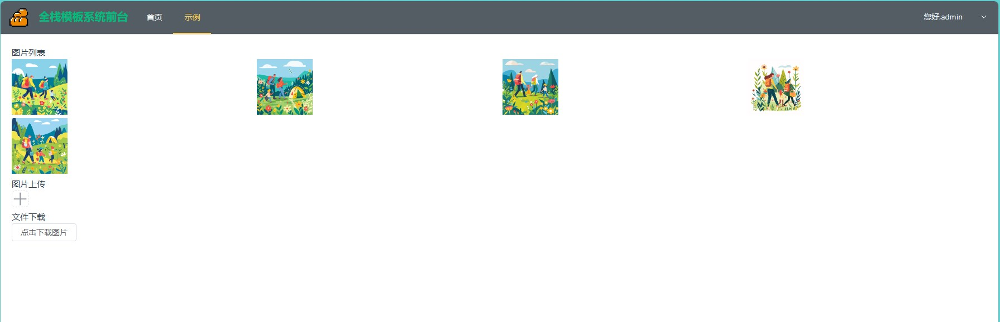

# 项目介绍
django + vue + taro 管理系统模板
模板提供基本的前后台分离框架，用来快捷的开发web和小程序  
* 后台: python39 + django + rest + jwt + redis
* web端: vite + vue + element-ui-plus
* 小程序端: taro + vue

## 目录结构
- META 容器配置相关
- src/backend python后端
- src/clientMB taro小程序端
- src/clientWeb vue网页端
- docker-compose.yaml 项目启动文件
- .env_example 运行项目前需要先查看文件内配置式是否符合要求，修改完后copy出.env文件到同级目录下

## 项目启动
* docker-compose up -d
> 如果要全量启动项目，请对docker-compose.yaml内部分容器取消注释
* web端本机访问: http://localhost:8001/login
* 小程序端: http://localhost:8002/#/pages/index/index

# 项目截图
## web端
1. 登录

2. 示例页

后端:
# 注意事项
1. 因为后端apt源没有修改,所以如果速度慢，最好开启vpn后再开始构建镜像

# 开发进度
* [ ] web端
  * [x] 账户密码登录
  * [x] 文件上传和下载
  

