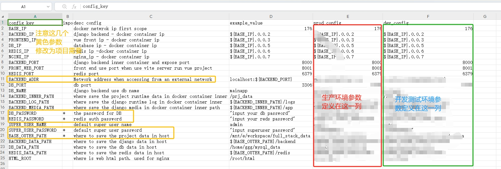
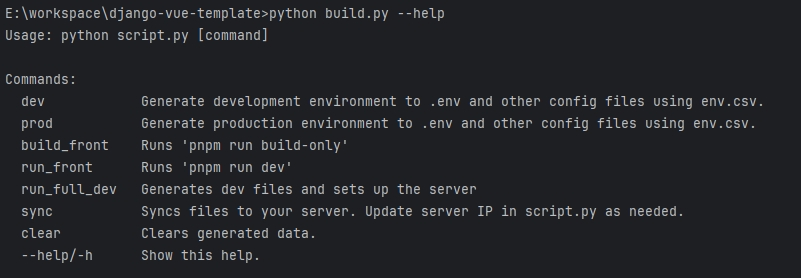

# project introduce
django + vue + taro management system template  
Template based on front and rear end separation  
include feature:
- jwt login/logout
- celery task
- test scope
- permission group Edit(todo)

# project setup and develop
## requirements list
* host machine requirement
  * docker/docker-compose
  * python3.x
* technical points involved in the code
  * backend: python39 + django + rest + jwt + redis
  * frontend: vite + vue + element-ui-plus

## how to startup project
1. copy the env_template.csv to env.csv and write your config.

2. use build.py generate config file(such as nginx,mysql,...)

## edit front-end code
1. python build.py dev # host machine
2. docker-compose up -d --build # host machine
3. open browser with url "http://localhost:4321/?folder=/web"
4. password as ./META/frontWeb/code-server_config.yaml -> 'password' element

## 目录结构
- __META__ container related
- __src/backend__ python backend
- __src/clientWeb__ vue frontend
- __build.py__ many tools help you run this project

# project's screenshot
1. login

2. fileupload and download

# 注意事项
1. 因为后端apt源没有修改,所以如果速度慢，最好开启vpn后再开始构建镜像

# 开发进度
* [ ] frontend
  * [x] account login and logout
  * [x] fileupload and download

